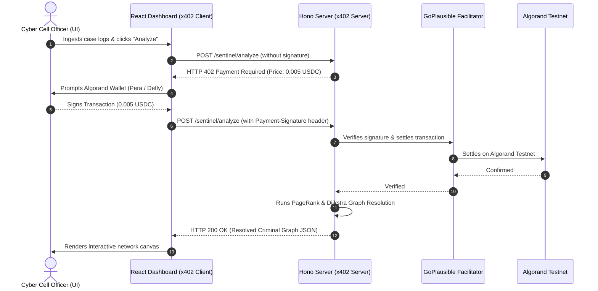

# 🛡️ Sentinel Link - AI-Powered Criminal Network Analysis System
### *Track: Agentic Solutions: Powered by x402 on Algorand*

**Team Name:** APEX LOGIC  
**College:** ABES Engineering College  
**Team Members:** Vansh Sirohi, Varun Mishra, Vaibhav Thakur, Soumya Verma, Utkarsh Sharma  

---

## 📌 Project Overview
**Sentinel Link** is an AI-powered link-analysis and graph intelligence dashboard built for cyber crime cells and investigative agencies. It ingests unstructured case files (FIRs), telecom records (CDRs), and banking statements to construct a real-time relational graph.

By integrating the **x402 HTTP Payment Protocol** on the **Algorand Blockchain** (via the **GoPlausible Facilitator**), Sentinel Link unlocks pay-per-query criminal intelligence with sub-cent micropayments ($0.005 USDC) settled on Algorand Testnet.

---

## ✨ Key Features
* 🕸️ **Interactive Graph Visualizer:** 60fps spring-physics force layout canvas with node dragging and dynamic clustering.
* 🎯 **PageRank Kingpin Identification:** Graph centrality ranking highlighting syndicate leaders in real-time.
* 🔍 **Dijkstra Shortest Path Routing:** Traces multi-hop financial trails and spoofed telecom connections between suspects.
* 💳 **x402 Algorand Protocol:** Sub-second, non-custodial micropayments for API routes using TestNet USDC (`ASA: 10458941`) and GoPlausible facilitator verification.
* ⚡ **Dual Execution Mode:** Includes a standalone prototype mode (zero-wallet direct testing) alongside the live Algorand x402 paywall mode.

---

## 🏗️ Architecture & x402 Payment Flow



---

## 🚀 Quick Start Guide

### 1. Prerequisites
* Node.js v18+
* Algorand Wallet (Pera / Defly) set to **TestNet**
* Free TestNet ALGO & USDC (ASA ID: `10458941`)

---

### 2. Backend Setup
```bash
cd x402-demo-server
npm install
cp .env.example .env
npm run dev
```
*Backend runs on `http://localhost:4021`.*

---

### 3. Frontend Setup
```bash
cd X402-Usecase/projects/X402-Usecase
npm install
npm run dev
```
*Frontend runs on `http://localhost:5173`.*

---

## 🛠️ Tech Stack & Dependencies
* **Blockchain:** Algorand Testnet, `@x402-avm/avm`, `@x402-avm/fetch`, `@x402-avm/core`, GoPlausible Facilitator
* **Frontend:** React 18, Vite, Tailwind CSS, DaisyUI, `@txnlab/use-wallet-react`
* **Backend:** Hono Framework, Node.js, TypeScript, PageRank & Dijkstra custom graph solvers
* **Payment Asset:** Testnet USDC (ASA ID: `10458941`)

---

## 📄 License
MIT License. Built for **Build with Bharat 2.0 / NIT Delhi Hackathon 2026**.
